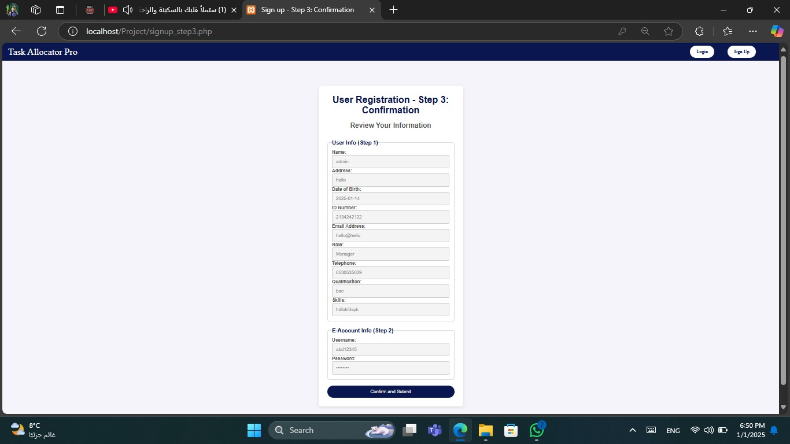
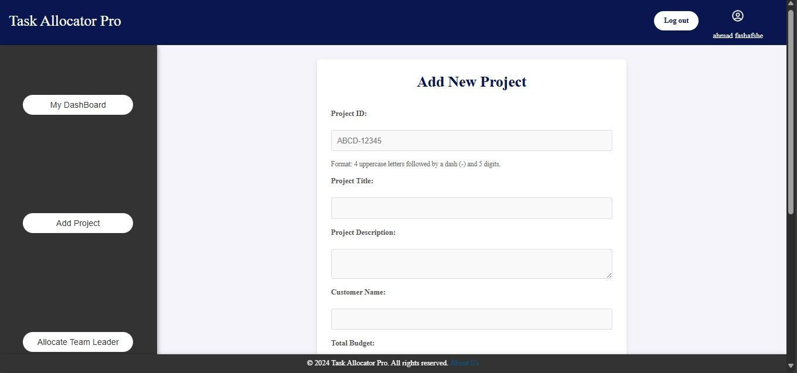
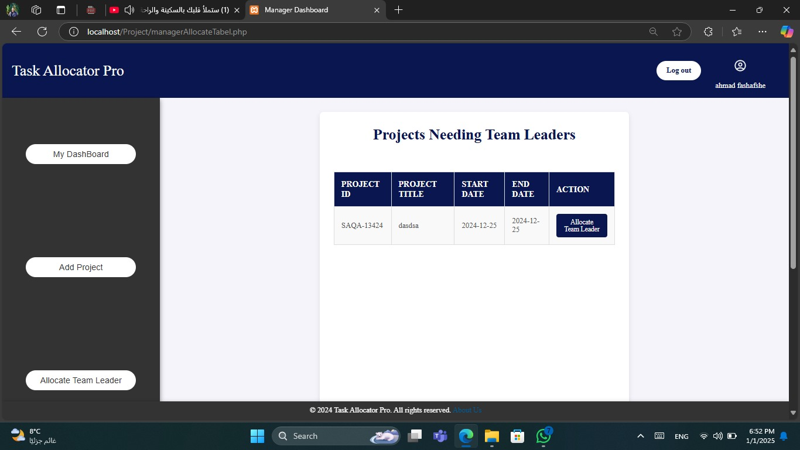
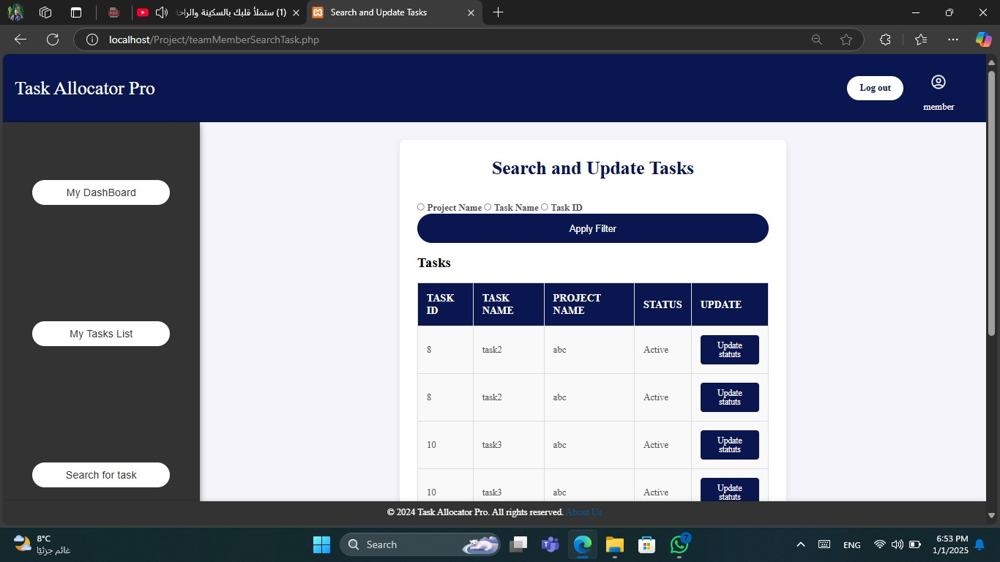

# 📌 Task Allocator Pro (TAP)

**Task Allocator Pro (TAP)** is a lightweight task management web application built using PHP, HTML, CSS, and MySQL. Designed to help small teams manage their workflows effectively, TAP allows managers to create projects, assign leaders, and track progress, while giving team members an intuitive interface to update and manage their own tasks.

---

## 🚀 Features

### 🔐 User Management
- Multi-step registration (with session handling)
- Login and logout
- Role-based access (Manager, Project Leader, Team Member)

### 👤 Manager
- Add new projects with full details
- Upload supporting documents
- Allocate team leaders to projects

### 🧑‍🏫 Project Leader
- Create tasks for projects
- Assign team members with role and contribution %
- Validate contribution sums and manage progress

### 👨‍💻 Team Member
- Accept or reject assigned tasks
- View assigned tasks and details
- Update task status and completion via slider

### 🔍 Search & Track
- Search tasks by ID, name, priority, status, or project
- Filter based on role-specific access
- Track progress in real-time

---

## 📷 Screenshots

> All screenshots are located in the `screenshots/` directory.

| Screenshot | Description |
|------------|-------------|
|  | **User Registration** — Multi-step form for registering new users with session-based validation. |
|  | **Manager Dashboard** — Interface for managing projects and assigning team leaders. |
|  | **Add Project Form** — Clean layout to create projects with file upload support. |
|  | **Allocate Team Leader** — Form for assigning a project leader with preloaded project info. |
|  | **Task Creation** — Project Leaders can define and schedule tasks within their projects. |
|  | **Accept Task** — Team members can review and accept/reject task assignments. |
|  | **Search Tasks** — Advanced task search and filtering options for all roles. |

---

## 🛠️ Tech Stack

- **Frontend:** HTML5, CSS3 (custom, no frameworks)
- **Backend:** PHP (PDO with prepared statements)
- **Database:** MySQL
- **Validation:** Server-side with custom CSS for user feedback

---

